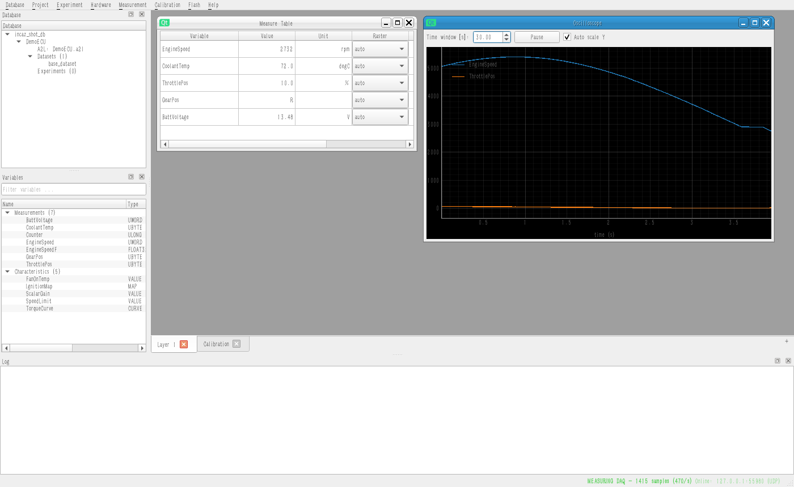

<p align="center">
  
</p>

# INCAZ

**INtegrated Calibration & Acquisition, Zero-cost** — an open-source ECU
measurement & calibration tool for **XCP on Ethernet**, built in Python on
[pyxcp](https://github.com/christoph2/pyxcp).

> *measure. calibrate. flash. 100% llama-powered, 0% license server.*


<p align="center">
  
</p>

INCAZ follows the classic measurement & calibration workflow used in
automotive ECU development:

```
Database  ->  Project (A2L)  ->  Dataset (HEX)  ->  Hardware (XCP/Ethernet)
          ->  Experiment (measure tables, oscilloscopes, calibration editors)
          ->  Recording (MF4)  ->  Flashing
```

## Features

- **Database** — folder-based calibration database (SQLite index + imported
  files) holding projects, datasets, experiments and hardware configurations.
- **A2L projects** — self-contained ASAP2 parser: MEASUREMENT,
  CHARACTERISTIC (VALUE / CURVE / MAP / VAL_BLK / ASCII), AXIS_PTS,
  COMPU_METHOD (IDENTICAL, LINEAR, RAT_FUNC, tables, verbal, FORM),
  RECORD_LAYOUT, GROUP/FUNCTION, memory segments and the XCP IF_DATA
  (transport parameters + DAQ event channels).
- **HEX datasets** — Intel HEX images for offline calibration and flashing.
- **Measurement** over XCP on Ethernet (**UDP and TCP**, via pyxcp):
  - *DAQ* mode — the ECU streams data from its own task rasters
    (event channels); per-variable raster assignment in the GUI, samples
    time-stamped on the raster grid, safe automatic raster selection.
  - *POLLING* mode — cyclic master reads that work with every XCP slave.
- **Multi-layer experiments** — the experiment is organised in *layers*
  (tabs, `Ctrl+T`): each layer holds its own measure tables (value/min/max),
  oscilloscopes (scrolling time window, pause, kHz-capable rendering) and
  calibration editors, all drag & drop from the variable browser.
  Measurement always covers the variables of every layer; layers, window
  geometry and raster assignments are saved with the experiment.
- **MF4 recording** (ASAM MDF 4.10 via asammdf) — one channel group per
  acquisition raster, equidistant raster timestamps, units and comments
  from the A2L.
- **Online & offline calibration** — scalar values, curves and maps with
  editable axes; writes go to the ECU working page when connected or into
  the HEX dataset when offline; working/reference page switching and
  reference→working copy.
- **Flash programming** — program a dataset into the ECU through the XCP
  PGM resource: `PROGRAM_START → PROGRAM_CLEAR → PROGRAM` (block mode) →
  checksum verification → `PROGRAM_RESET`, with progress bar and abort.
- **Demo ECU included** — `python -m incaz.sim` starts a simulated
  XCP slave (UDP + TCP on the same port) with live signals, calibration
  pages, DAQ and flash support, so you can try everything without hardware.

## Installation

### Windows, the easy way (no experience needed)

1. Install **Python 3.10+** from [python.org](https://www.python.org/downloads/)
   — tick *"Add python.exe to PATH"* during setup.
2. Download this repository:
   **Code ▸ Download ZIP** on GitHub, then extract it anywhere
   (or `git clone https://github.com/fupsrl/INCAZ.git`).
3. Double-click **`installer\install.bat`**.

That's it — an **INCAZ** shortcut appears on your desktop. To try it
without an ECU, double-click `installer\start_demo_ecu.bat` first.

### With pip (any platform)

```bash
pip install git+https://github.com/fupsrl/INCAZ.git
incaz
```

### From source (developers)

```bash
git clone https://github.com/fupsrl/INCAZ.git
cd INCAZ
python -m venv .venv
.venv\Scripts\activate          # Windows   (source .venv/bin/activate on Linux)
pip install -e .[dev]
incaz
```

## Quick start (no hardware needed)

1. **Start the demo ECU**: `python -m incaz.sim` (or
   `installer\start_demo_ecu.bat` on Windows). It serves XCP on UDP *and*
   TCP on port 5555.
2. **Start INCAZ**: `incaz`
3. In the GUI:
   - *Database ▸ New Database…* — create e.g. `mydb.incazdb`
   - *Project ▸ Import A2L…* — pick `demo/demo.a2l`
   - Right-click the project in the **Database** tree ▸
     *Add dataset (HEX)…* — pick `demo/demo.hex`
   - *Hardware ▸ Configure…* — defaults match the demo ECU
     (UDP, 127.0.0.1:5555); choose DAQ or POLLING measurement mode
   - Drag `EngineSpeed`, `CoolantTemp`, … from the **Variables** browser
     into a *Measure Table* or *Oscilloscope*
   - **F11** starts the measurement, **F12** records to MF4, **F9** stops
   - Double-click `ScalarGain` or `TorqueCurve` to calibrate online — the
     demo signals react immediately
   - Right-click the dataset ▸ *Flash to ECU…* to program the HEX via XCP
   - **Ctrl+S** saves the experiment (layers, windows, rasters) into the
     database

## Working with a real ECU

- Import your A2L; the transport parameters (IP / port / UDP / TCP) are
  pre-filled from `IF_DATA XCP` when present and editable under
  *Hardware ▸ Configure*.
- **Choose rasters deliberately** (DAQ mode): assign each variable to an
  event channel in the measure table's *Raster* column (or right-click a
  scope signal). Unassigned variables go to the cyclic raster closest to
  10 ms. Microsecond rasters stream thousands of samples per second —
  assign them only to the few signals that need it.
- The status bar shows a live sample counter (`MEASURING DAQ - 1415
  samples (470/s)`); it turns orange when nothing arrives — if that
  happens after an interrupted session, power-cycle the ECU to clear a
  stuck DAQ state.
- Seed & key DLLs are supported (*Hardware ▸ Configure ▸ Seed & Key DLL*).
- POLLING mode works with any slave but samples at the configured poll
  rate — fast signals will alias; prefer DAQ whenever available.

## Tests

```bash
pip install -e .[dev]
python demo/make_demo_hex.py     # once, generates the demo dataset
pytest
```

The end-to-end suite spins up the bundled demo ECU and exercises connect,
polling, DAQ, online calibration, MF4 recording and flashing — over both
UDP and TCP. GUI tests run headless (offscreen).

## Architecture

```
incaz/
  core/
    a2l/          A2L parser + object model
    conversions   COMPU_METHOD raw<->phys
    calibration   RECORD_LAYOUT decoding, characteristic read/write
    hexfile       Intel HEX memory image
    database      folder database (SQLite)
    hardware      XCP hardware configuration
    xcp_client    threaded pyxcp master wrapper (single-owner worker thread)
    acquisition   POLLING / DAQ acquisition, rasters, sample dispatch
    recorder      MF4 writer (asammdf)
    flash         flash engine (XCP PGM)
  gui/            PySide6 GUI (layers, MDI experiment, docks, dialogs)
  sim/            demo XCP slave simulator (UDP + TCP)
demo/             demo A2L + HEX for the simulator
installer/        one-click Windows installer + demo ECU launcher
```

## Roadmap

Per-variable measure-window update rates, STIM, CAN/CAN-FD transports,
dataset compare & copy, label lists, VAL_BLK grids, curve interpolation
helpers, checksum-verified flashing against local images, packaged
binaries. Contributions welcome — the code base is small and readable.

## Why the Z? (and why the llama?)

| Letter | Officially | Also acceptable |
|--------|-----------|-----------------|
| **IN** | INtegrated | INexpensive |
| **C**  | Calibration | Costs |
| **A**  | & Acquisition | Are |
| **Z**  | Zero-cost | Zero |

The mascot is a llama because a llama, like this tool, carries heavy loads
over difficult terrain, costs almost nothing to run, and occasionally
spits at license servers.

## License

MIT. Uses pyxcp (LGPL), asammdf (LGPL), PySide6 (LGPL), pyqtgraph (MIT),
intelhex (BSD).
